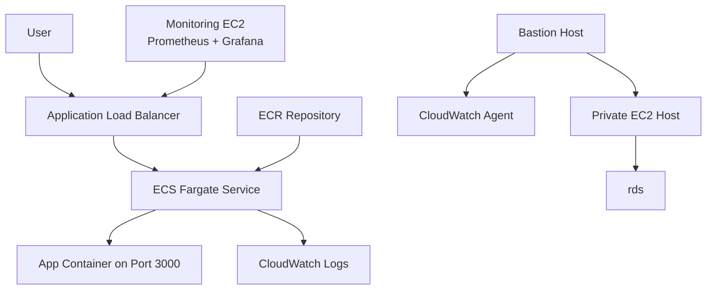

# AWS Three-Tier Infrastructure with Terraform

This project provisions a three-tier application environment on AWS using Terraform. It is organized into reusable modules for networking, security, compute, database, container registry, ECS, and load balancing.

The stack is designed around a common production-style pattern: public entry points are kept in public subnets, application workloads run in private networking, and the database is isolated in dedicated database subnets. Supporting infrastructure such as a bastion host, NAT Gateway, CloudWatch logging, Prometheus, and Grafana is included to make the environment easier to operate and inspect.

## Architecture Overview



## What Gets Created

The root Terraform configuration wires together the following modules:

| Module | Purpose |
| --- | --- |
| `networking` | Creates the VPC, public subnets, private subnets, database subnets, Internet Gateway, NAT Gateway, route tables, and subnet associations. |
| `security` | Creates security groups for the bastion host, private host, database, ECS tasks, ALB, and monitoring instance. |
| `database` | Creates a MySQL RDS instance in the database subnet group. |
| `compute` | Creates the bastion host, private EC2 host, monitoring EC2 instance, IAM role/profile, CloudWatch agent config, and monitoring EBS volume. |
| `ecr` | Creates an ECR repository for the application container image. |
| `ecs` | Creates the ECS cluster, Fargate task definition, ECS service, execution role, and CloudWatch log group. |
| `alb` | Creates the public Application Load Balancer, target group, and HTTP listener. |

## Infrastructure Details

- **Region:** Defaults to `us-east-2`.
- **VPC CIDR:** `10.0.0.0/16`.
- **Public subnets:** `10.0.1.0/24` and `10.0.2.0/24`.
- **Private subnets:** `10.0.3.0/24` and `10.0.4.0/24`.
- **Database subnets:** `10.0.5.0/24` and `10.0.6.0/24`.
- **Application port:** `3000` behind an Application Load Balancer on port `80`.
- **Database:** MySQL 8.0 on `db.t3.micro`.
- **Monitoring:** Prometheus and Grafana run on a dedicated EC2 instance.
- **Remote state:** The main stack uses an S3 backend in `three-tier-tf-state-us-east-2`.

## Repository Structure

```text
.
├── 00-bootstrap/          # Creates the S3 bucket used for remote Terraform state
├── module/
│   ├── alb/               # Application Load Balancer resources
│   ├── compute/           # EC2, IAM, CloudWatch, and monitoring resources
│   ├── database/          # RDS MySQL resources
│   ├── ecr/               # Elastic Container Registry repository
│   ├── ecs/               # ECS Fargate cluster, service, and task definition
│   ├── networking/        # VPC, subnets, gateways, and route tables
│   └── security/          # Security groups and ingress/egress rules
├── main.tf                # Root module composition
├── variable.tf            # Root variables
├── outputs.tf             # Root outputs
└── terraform.tfvars       # Local variable values
```

## Prerequisites

Before deploying, make sure you have:

- Terraform `>= 1.2` installed.
- AWS credentials configured locally with permission to create VPC, EC2, RDS, ECS, ECR, IAM, S3, CloudWatch, and load balancer resources.
- An SSH public key at `~/.ssh/bastion-key.pub`, because the compute module creates an AWS key pair from that file.
- A container image available in ECR before the ECS service can keep healthy tasks running.

## Deployment Steps

### 1. Create the remote state bucket

The `00-bootstrap` directory uses local state and creates the S3 bucket used by the main Terraform backend.

```bash
cd 00-bootstrap
terraform init
terraform plan
terraform apply
```

### 2. Initialize the main stack

After the backend bucket exists, initialize the root Terraform configuration.

```bash
cd ..
terraform init
```

### 3. Review the plan

```bash
terraform plan
```

### 4. Apply the infrastructure

```bash
terraform apply
```

### 5. Push the application image

After ECR is created, authenticate Docker to ECR, build the application image, and push it to the repository shown in the Terraform output.

```bash
aws ecr get-login-password --region us-east-2 | docker login --username AWS --password-stdin <account-id>.dkr.ecr.us-east-2.amazonaws.com
docker build -t three-tier-app .
docker tag three-tier-app:latest <ecr-repository-url>:latest
docker push <ecr-repository-url>:latest
```

If the ECS service was created before the image existed, force a new deployment after pushing the image.

```bash
aws ecs update-service \
    --cluster three-tier-app-cluster \
    --service three-tier-app-service \
    --force-new-deployment \
    --region us-east-2
```

The ECS task definition currently points at the ECR repository URL, which resolves to the default image tag. In a production workflow, pinning the image to an explicit tag or digest is recommended so deployments are predictable.

## Outputs

The root module exposes:

| Output | Description |
| --- | --- |
| `ecr_repository_url` | URL of the ECR repository used by the ECS task. |
| `alb_dns_name` | Public DNS name of the Application Load Balancer. |
| `monitoring_public_ip` | Public IP address of the monitoring EC2 instance. |

## Accessing the Environment

- **Application:** Open `http://<alb_dns_name>` after the ECS task is healthy.
- **Grafana:** Open `http://<monitoring_public_ip>:3000`.
- **Prometheus:** Prometheus runs on the monitoring instance at port `9090`, but the current security group does not expose that port publicly. Use an SSH tunnel or add a controlled ingress rule if direct access is required.
- **Bastion SSH:** Use the `bastion-key` private key that matches `~/.ssh/bastion-key.pub`.

## Important Configuration Notes

This repository is a strong infrastructure starting point, but a few values should be reviewed before using it beyond a lab or demo environment:

- The SSH source IP is currently hardcoded in the security module. Replace it with your own trusted IP range or make it a variable.
- The database security group currently allows MySQL only from the private EC2 host security group. If the ECS application needs direct database access, add a controlled MySQL ingress rule from the ECS security group.
- The RDS username and password are currently defined directly in Terraform. Move database credentials to AWS Secrets Manager, SSM Parameter Store, or Terraform variables marked as sensitive.
- Terraform state and variable files can contain sensitive information. Keep `*.tfstate`, `*.tfstate.*`, and environment-specific `.tfvars` files out of Git history.
- Grafana is created with a default admin password in EC2 user data. Replace it before exposing the monitoring instance.
- The RDS instance uses `skip_final_snapshot = true`, which is convenient for testing but risky for persistent environments.
- The ECR repository has `force_delete = true`, so images can be deleted when the repository is destroyed.
- The ALB listener is HTTP only. Add HTTPS with ACM certificates for public-facing workloads.

## Useful Commands

```bash
# Format Terraform files
terraform fmt -recursive

# Validate Terraform configuration
terraform validate

# Show planned infrastructure changes
terraform plan

# Apply changes
terraform apply

# Destroy the environment when no longer needed
terraform destroy
```

## Cleanup

To remove the infrastructure, destroy the main stack first and then the bootstrap stack if you no longer need the remote state bucket.

```bash
terraform destroy

cd 00-bootstrap
terraform destroy
```

Be careful when destroying the bootstrap stack. It manages the S3 bucket that stores Terraform state for the main environment.